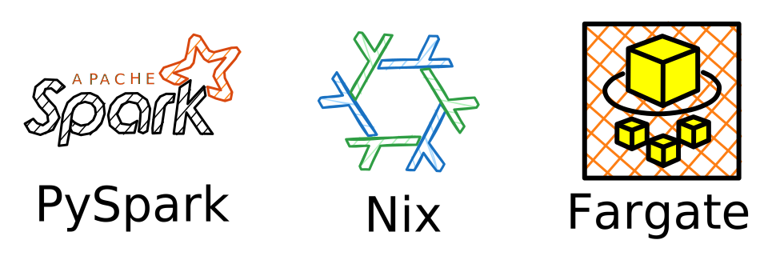
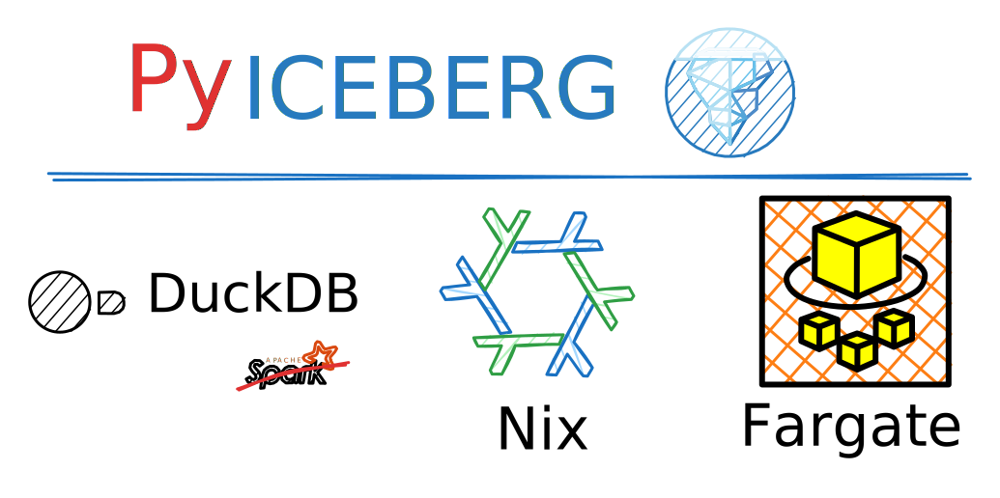

## Introducción

Un tema recurrente que recientemente hemos enfrentado en Draftea es el manejo de
datos cuando estos son lo suficientemente pequeños como para procesarse de la
forma más eficiente en motores _single-node_, como [DuckDB](https://duckdb.org/)
o [Polars](https://pola.rs/).

Actualmente, la mayoría de las herramientas que se desarrollan en el ecosistema
de datos son "Spark-centric", donde herramientas de la JVM son _first-class
citizens_, y desde ahí se crean integraciones a otros espacios (si bien esto
parece ir cambiando, como con DataFow o Arrow).

Esto nos lleva a pensar cómo podemos aprovechar las integraciones de Spark sin
necesariamente "casarnos" con un framework que de entrada podría ser _overkill_
para nuestras necesidades. En otras palabras, la idea es utilizar a fondo la
plataforma de integraciones de Spark, pero utilizando herramientas que nos
permitan modular de forma precisa los recursos que utiliza y que además nos
puedan servir de "trampolín" para luego migrar a otra herramienta con el menor
_overhead_ posible.

## Declarativo, serverless y escalable

### Apache Iceberg como catalizador

Presentemos un problema particular: Apache Iceberg. Este es un _table format_
surgido en Netflix y luego donado a la Fundación Apache, que se define como
sigue:

> [...] the Iceberg table format that is designed to manage a large,
> slow-changing collection of files in a distributed file system or key-value
> store as a table.

Actualmente es uno de los formatos más utilizados y mejor integrados en varias
herramientas, como Snowflake, AWS Athena, AWS Glue Catalog, Dremio, Starrocks,
etc. Ofrece garantías ACID junto con un montón de otras virtudes que hacen que
sea generalmente una pieza central en data lakehouses modernos, y que cumpla un
rol central en lo denominado _Modern Data Stack_.

Sin embargo, actualmente la integración de Iceberg en lenguajes o entornos que
no estén en Spark o la JVM aún está en etapas tempranas, como por ejemplo,
[PyIceberg](https://github.com/apache/iceberg-python), la implementación en
Python, que sigue en la versión 0.8 al momento de escribir este post, donde
faltan aspectos importantes y útiles como `MERGE` DML commands que sí están
disponible en Spark. Estas funcionalidades podrían ser fundamentales en el
diseño de tablas _SCD Type 2_ de forma eficiente.

Son generalmente estos _sharp edges_ que hacen que uno termine decantándose por
Spark, por más que sea matar moscas a cañonazos. Pero eso no quita que se pueda
optimizar su uso para reducir costos, y tener un manejo de la infraestructura
que nos permita luego evolucionar nuestra solución cuando el ecosistema de
paquetes dentro de los _single-node processors_ mejore.

### Spark, pero a que costo?

Ahora, entendiendo la necesidad de utilizar Spark aun con _datasets_ pequeños,
tenemos que tener en cuenta la eficiencia con lo que estamos corriendo nuestro
proceso. Por ejemplo, un Glue job requiere al menos dos DPUs (unidades de
computo), cada una con un costo de 0.44 USD/h. Esto puede ser un costo
relativamente alto para procesamiento de datos pequeños.

Una alternativa interesante sería correrlo de forma standalone en
**containers**. Además, algo que tiene de ventaja Glue es su condición de
_serverless_, lo que reduce en gran medida el mantenimiento y elimina la
administración de clusters. Ese mismo beneficio lo podemos lograr al correr
nuestros jobs en contenedores en Fargate, con la flexibilidad de asignar tantos
recursos como sea necesario y sin manejar clusters!

### Spark, Fargate... Nix?

Como dice el titulo, la propuesta a este problema es "Nix + PySpark + Fargate".
Ya explicamos el porque de PySpark y Fargate, y ahora pasamos a la tercera pata
(y la más esotérica), que es la clave para lograr entornos reproducibles y
declarativos: **Nix**.

¿Qué es Nix? Podemos decir que es un _package builder/manager_, un lenguaje de
programación, y un sistema operativo (NixOS), y que tiene como cualidad el ser
declarativo y totalmente reproducible. En el post nos vamos a centrar
principalmente en las primeras dos cualidades.

El uso de Nix nos va a permitir, desde un único archivo, configurar y declarar:
una shell de desarrollo con todas las dependencias necesarias, una aplicación
ejecutable, y una imagen de Docker. Todo esto sin escribir bash, ni TOML, ni un
Dockerfile (pero si nix 😜).

En resumen, Nix es una herramienta muy útil, que en nuestro caso nos va a
permitir desarrollar en un entorno relativamente complejo (dependencias de la
JVM, Python, y más) en un marco de trabajo totalmente reproducible a partir de
un archivo de configuración declarativo. Esto nos asegura que lo que estemos
corriendo en local, es exactamente lo que estamos empaquetando en una imagen y
subiendola a AWS.

Para un poco más de información, recomiendo leer un poco de la
[página oficial](https://nixos.org/explore/), o en comunidades de Reddit.

#### Pero y que de Poetry/uv/pipenv/etc!?!?!?!?

Lo vamos a usar! Nix es agnóstico al lenguaje. A partir de herramientas como
`uv2nix` o `poetry2nix`, puede integrarse perfectamente a nuestro flujo de
trabajo, incorporando las ventajas de Nix pero sin perder integración con
tooling existente.

En nuestro caso, el desarrollo va a ser en `uv` como base, pero podría
replicarse en general de la misma forma con alguno de los otros manejadores de
paquete.

Como nota, tengo un repo (en desarollo) que funciona como especie de
_quickstart_ para usar Nix con uv:
[nix-python-demo](https://github.com/francocalvo/nix-python-demo/tree/main)

### Spark? No, DuckDB 🥷

A la gente que se enfoca en
[platform engineering](https://platformengineering.org/blog/what-is-platform-engineering),
todo lo anterior le puede resultar super interesante. Pero que valor les da esto
a equipos de negocio o de data? Hasta ahora venimos describiendo Spark with
extra steps.

Como dijimos al principio, llegamos a Spark por necesidad en cuanto a
integraciones, no por su capacidad de computo, por lo que en el momento que el
ecosistema madure, lo mejor sería poder migrar rápidamente al mismo.

Acá es donde todo lo que venimos planteando suma mucho valor. DuckDB, uno de los
motores de procesamiento de datos que funcionan en un solo nodo, tiene
implementada una [Spark API](https://duckdb.org/docs/api/python/spark_api.html).
Con la estructura armada, dentro de un container de Fargate, con un toolchain
completo en Python, e idealmente con un sistema de CICD que integre de forma
automática los cambios en ECR, la migración podría ser en gran medida, y
dependiendo la complejidad del sistema, un par de cambios de líneas de código.
Incluso en el peor de los casos el core de la lógica de negocios,
transformaciones y demás, podría mantenerse.

### Costos

Una pregunta importante a hacerse cuando nos proponemos esto es, vale la pena?
Cuanto puede ser la diferencia entre correr nuestros jobs en Fargate contra
hacerlo en Glue jobs?

La respuesta es que, en casos donde podamos correr nuestros procesos en un solo
nodo (menos de 10-25GB de datos), la diferencia puede ser buena. Llevándolo a
los números, y tomando como referencia la configuración mínima de Glue (2 DPUs)
y la
[configuración mínima recomendada](https://spark.apache.org/docs/latest/hardware-provisioning.html)
para Spark (8GB RAM 8vCPU), podemos ver los siguientes costos:

- 2 DPU \* 0.44 = 0.88 por hora.
- **8 \* 0.04048 + 8 \* 0.004445 = 0.3594 por hora**

Es decir, si nuestra data no es lo suficientemente grande para necesitar
escalar, podríamos estar pagando casi 2.5 veces más por su uso! Esto, además, es
mejorable, porque podríamos hacer una optimización de recursos de cada job en
Fargate de forma que incluso la diferencia pueda ser mayor, ya que los DPUs
aumentan de forma discreta y en pasos bastante grandes.

## Conclusión

Si bien falta una segunda parte de este post donde se pueda desplegar la
implementación técnica de la propuesta, la idea es dejar en claro que hay buenas
alternativas a el uso de Spark de forma serverless, de forma tal que podamos
apalancarnos de sus integraciones.

Así, nuestra alternativa de ‘Nix + PySpark + Fargate’ se presenta como un ‘poor
man's AWS Glue’: mantiene la flexibilidad y escalabilidad, pero con un costo y
complejidad más acotados, y la posibilidad de migrar a motores más ligeros como
DuckDB en cuanto el ecosistema lo permita.
